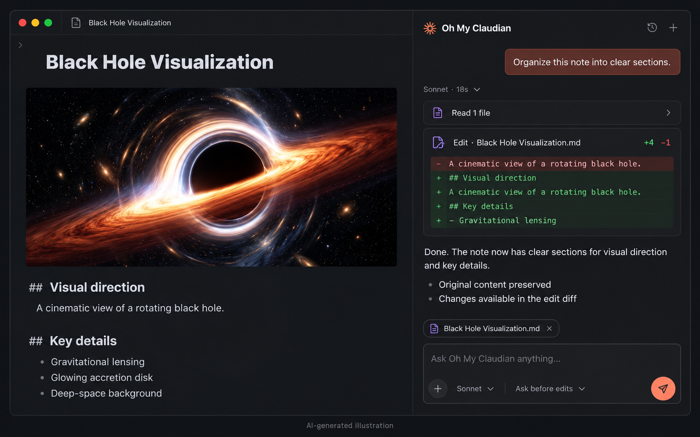

# Oh My Claudian

Bring your coding agent into [Obsidian](https://obsidian.md/): ask questions about your notes, review file edits, and run multi-step workflows in your vault.

[Install](https://community.obsidian.md/plugins/oh-my-claudian) · [Quick start](#quick-start) · [Usage](#usage) · [Releases](https://github.com/lee259/oh-my-claudian/releases) · [Report a bug](https://github.com/lee259/oh-my-claudian/issues)



*AI-generated illustration of the current workflow; interface details may vary by theme and provider.*

## What you can do

- **Work with your notes.** Attach files or folders, ask the agent to compare sources, summarize a topic, or reorganize a draft.
- **Review changes.** Expand file-edit cards to inspect the diff, or select note text and preview an inline edit before applying it.
- **Follow longer tasks.** Read the latest reply while completed tool activity folds into expandable summaries. Scroll back to inspect earlier work without losing your reading position.
- **Use your existing agent setup.** Choose from seven provider integrations, with provider-native authentication, configuration, and permissions.

This project started as a fork of [Claudian](https://github.com/YishenTu/claudian). It is now a maintained, local-first workspace for multiple coding-agent providers.

## Supported providers

The built-in provider integrations are:

- [Claude Code](https://code.claude.com/docs/en/overview)
- [Codex CLI](https://github.com/openai/codex)
- [Cursor Agent](https://cursor.com/docs/cli/overview)
- [Grok Build](https://github.com/xai-org/grok-build)
- [Oh My Pi (OMP)](https://github.com/can1357/oh-my-pi)
- [OpenCode](https://github.com/anomalyco/opencode)
- [Pi](https://github.com/earendil-works/pi)

Provider capabilities are intentionally different. The plugin exposes controls only when the selected provider supports them; model discovery, permissions, history, planning, MCP, and runtime behavior remain provider-specific. The Obsidian-native vault actions below are currently available in Claude, Codex, OpenCode, and Pi.

## Requirements

- Obsidian 1.7.2 or newer on desktop: macOS, Linux, or Windows.
- At least one supported provider CLI installed and authenticated according to its own documentation.
- A compatible subscription or API provider.

## Installation

### Community Plugins

1. Open **Settings → Community plugins → Browse** in Obsidian.
2. Search for **Oh My Claudian**, install it, and enable it.

You can also open the [Oh My Claudian community plugin page](https://community.obsidian.md/plugins/oh-my-claudian) directly.

For a source build, see [Development](#development).

## Quick start

1. Open **Settings → Oh My Claudian** and choose a provider tab.
2. Enable the provider and check its **Readiness** panel. Use the offered action to install or update its CLI, or set an executable path if discovery fails.
3. Sign in through the provider's own CLI when required. For example, Cursor Agent uses `agent login`.
4. Enable the models you want to use in that provider's settings and select one in the chat composer.
5. Open the chat from the ribbon icon or command palette. Type `@` to attach a note, then try: **"Summarize this note and suggest three improvements."**

CLI installation and updates show the command for confirmation and check the result afterward. Available actions depend on the provider's distribution and version metadata.

## Usage

### Give the agent context

Type `@` to choose vault files or provider resources, or drag files and folders into the composer. Attachments appear as clickable context chips. Files from outside the vault must be attached explicitly; see [Safety and privacy](#safety-and-privacy) for access boundaries.

Type `/` to discover commands and skills supported by the selected provider. Instruction mode and Mermaid rendering are also available; provider-specific resources and controls depend on that provider's capabilities.

### Read a conversation and inspect changes

The chat uses one conversation panel with history and session navigation. Start a new conversation or choose an earlier session to continue it. Resume, fork, and compact behavior depends on the selected provider.

Completed work is grouped into expandable summaries. Open a summary to inspect its tool calls; expand a file-edit card to see the diff when the provider supplies supported edit data.

With **Auto-scroll during streaming** enabled, new content follows the bottom. Scroll up to read earlier content; return to the bottom to resume following. Expanded work history keeps its own reading position. Use **Expand file edits by default** in the display settings if you prefer to see edit details immediately.

### Edit selected text

Select text in a note and run the inline-edit command from Obsidian's command palette. Describe the change, inspect the word-level diff, and apply the result.

### Choose a model

Only models enabled in provider settings appear in the composer. The button shows the selected catalog name; configured aliases can override supported custom-model labels. Claude names come from its SDK model catalog, so a tier may display the name reported by your configured backend. Environment mappings still determine execution routing.

### Use Obsidian-native vault actions

Claude, Codex, OpenCode, and Pi can inspect backlinks, update or remove note frontmatter properties, move or rename vault files while Obsidian handles link updates, and send files to Obsidian trash.

The UI is available in 10 locales, including Simplified and Traditional Chinese.

## Troubleshooting

| Problem | What to check |
| --- | --- |
| Provider CLI is not found | Check **Readiness** in the provider's settings. If the CLI works in a terminal but is not discovered in Obsidian, set its executable path. GUI applications can have a different `PATH`. |
| No model is available | Refresh the provider's model catalog, enable the models you want, and check CLI authentication. |
| A control or command is missing | Check whether the selected provider supports it. Provider integrations expose different capabilities. |
| An edit card has no diff | The provider must return a supported diff or edit payload. A successful tool status alone does not include changed lines. |

For provider installation and authentication, use the official documentation linked under [Supported providers](#supported-providers). For a plugin issue, [report a bug](https://github.com/lee259/oh-my-claudian/issues) with your plugin version, Obsidian version, operating system, provider, CLI version, and reproduction steps. Remove credentials and private note content from logs or screenshots.

## Safety and privacy

Oh My Claudian is local-first and does not send telemetry. Your prompts, attachments, and tool results are sent to the provider you select and its configured model services. Network access also includes CLI version checks against the npm registry and configured MCP endpoints. CLI discovery and launches read relevant local environment variables, such as `PATH`, `HOME`, and `USERPROFILE`, to locate and run provider CLIs. These values are used locally and are not collected for plugin telemetry; provider CLI processes may use their inherited environment according to their own behavior.

The vault is the agent's working directory, not an operating-system security boundary. A local CLI, shell command, MCP server, plugin, or child process may access files, network services, and credentials available to your OS account. Safe/approval mode reduces accidental actions but cannot guarantee isolation. Review provider permissions carefully, especially before enabling YOLO, bash mode, browser access, MCP servers, or external context paths.

External files are attached explicitly as context. Attaching or mentioning a file does not grant write access; direct edits outside the vault are subject to the provider approval flow when supported.

## Development

Use Node.js 24 and the pnpm version declared in `package.json`. To build directly in a vault:

```bash
cd /path/to/vault/.obsidian/plugins
git clone https://github.com/lee259/oh-my-claudian.git
cd oh-my-claudian
pnpm install
pnpm run build
```

Enable the plugin under **Settings → Community plugins**. For ongoing development:

```bash
pnpm run dev
pnpm run typecheck
pnpm run lint
pnpm run test
pnpm run build
```

`pnpm run dev` watches TypeScript, styles, and `manifest.json`. See [`CONTRIBUTING.md`](CONTRIBUTING.md) for contribution and validation guidance. [GitHub Releases](https://github.com/lee259/oh-my-claudian/releases) contains version-specific changes.

## License

Licensed under the [MIT License](LICENSE).
